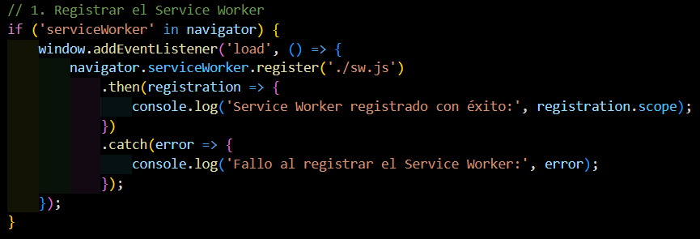
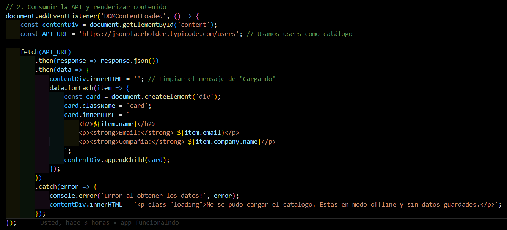
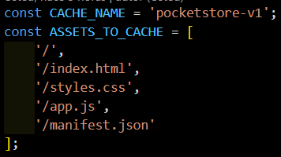
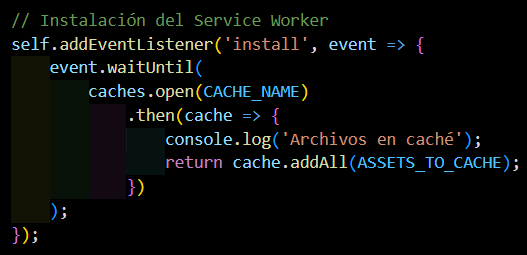
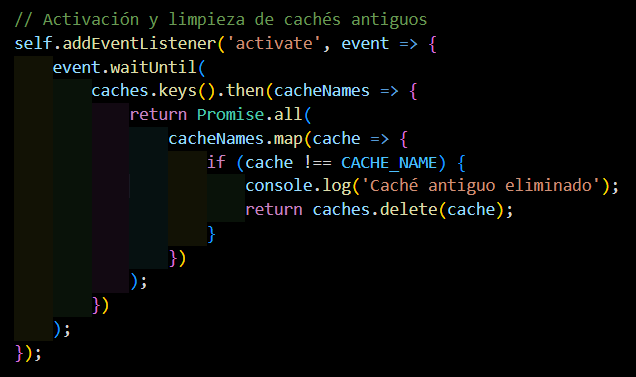
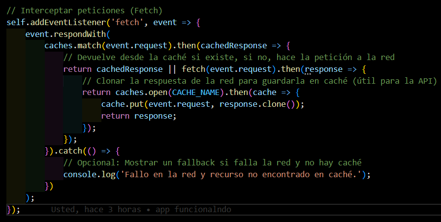

# PocketStore

PocketStore es una aplicación web de una sola página (SPA) que funciona como un
catálogo de demostración. Utiliza tecnologías PWA (Progressive Web App) para
cargar su estructura desde la caché y continuar funcionando cuando no hay
conexión a internet.

## Características

- **App Shell:** `index.html` y `styles.css` definen la interfaz inicial.
- **Modo offline:** `sw.js` utiliza Service Workers y Cache Storage para
  conservar los recursos de la aplicación.
- **Contenido dinámico:** `app.js` consulta el catálogo de usuarios de
  `JSONPlaceholder` y crea las tarjetas en pantalla.
- **Instalable:** `manifest.json` define el nombre, colores, iconos y modo de
  presentación de la aplicación.

## Estructura del proyecto

| Archivo | Responsabilidad |
| --- | --- |
| `index.html` | Estructura HTML, contenedor `#content`, mensaje de carga y referencias a los recursos. |
| `app.js` | Registra el Service Worker y obtiene/renderiza el catálogo. |
| `sw.js` | Instala la caché, elimina cachés antiguas e intercepta peticiones. |
| `styles.css` | Estilos visuales de la aplicación y de las tarjetas. |
| `manifest.json` | Metadatos necesarios para instalar la PWA. |
| `images/` | Recursos gráficos de la aplicación. |

## Documentación de `app.js`

`app.js` no expone funciones con nombre; organiza su comportamiento mediante
callbacks asociados a eventos y promesas.

### 1. Registro del Service Worker

El primer bloque comprueba que el navegador soporte `serviceWorker`. Después
del evento `load`, ejecuta:

```js
navigator.serviceWorker.register('./sw.js')
```

- **Callback de éxito:** muestra en la consola el alcance (`scope`) del
  Service Worker cuando `sw.js` se registra correctamente.
- **Callback de error:** informa en la consola si el registro falla.

Este registro permite que `sw.js` gestione la caché y las peticiones de la
aplicación. El navegador exige que la página se sirva desde `localhost` o
HTTPS; abrir `index.html` directamente no es suficiente.

 

### 2. Carga del catálogo

El callback de `DOMContentLoaded` espera a que el HTML esté listo y obtiene el
elemento `#content`, que inicialmente contiene el mensaje `Cargando
catálogo...`.

Luego consulta la constante `API_URL`:

```js
const API_URL = 'https://jsonplaceholder.typicode.com/users';
```

El flujo de promesas es el siguiente:

1. `fetch(API_URL)` realiza la petición HTTP.
2. `response.json()` convierte la respuesta a un arreglo de objetos.
3. Se limpia `#content` para quitar el mensaje de carga.
4. `data.forEach(...)` recorre cada elemento del catálogo.
5. Para cada elemento se crea un `div.card` con su nombre, correo y compañía,
   y se agrega al contenedor mediante `appendChild`.



### 3. Manejo de errores

Si la petición o la conversión de la respuesta falla, el callback de `catch`
registra el error en la consola y reemplaza el contenido por el mensaje:

> No se pudo cargar el catálogo. Estás en modo offline y sin datos guardados.

Los datos de la API pueden quedar guardados por el Service Worker después de
una carga exitosa; por eso es recomendable visitar la aplicación al menos una
vez con conexión antes de probarla sin internet.

## Documentación de `sw.js`

`sw.js` es el Service Worker de PocketStore. Se ejecuta en segundo plano y
controla la caché de los recursos y de las peticiones realizadas por la
aplicación. El archivo utiliza tres eventos principales: `install`, `activate`
y `fetch`.

### Constantes de caché



- `CACHE_NAME` identifica la versión actual de la caché. Debe cambiarse cuando
  se publiquen recursos nuevos y sea necesario invalidar la versión anterior.
- `ASSETS_TO_CACHE` contiene los archivos esenciales del App Shell que se
  guardarán durante la instalación. Estos recursos permiten abrir la
  estructura básica de la aplicación sin conexión.

### Evento `install`

El evento `install` se ejecuta cuando el navegador instala el Service Worker.
`event.waitUntil(...)` mantiene el proceso activo hasta que termina la
operación asíncrona:

1. `caches.open(CACHE_NAME)` crea o abre la caché `pocketstore-v1`.
2. `cache.addAll(ASSETS_TO_CACHE)` descarga y almacena los recursos definidos.
3. Se escribe `Archivos en caché` en la consola cuando comienza el guardado.

Si alguno de los archivos no puede almacenarse, la instalación puede fallar y
el navegador conservará el Service Worker anterior.



### Evento `activate`

El evento `activate` se ejecuta cuando el Service Worker queda activo,
normalmente después de una instalación nueva. Su objetivo es eliminar cachés
que ya no corresponden a `CACHE_NAME`:

1. `caches.keys()` obtiene los nombres de las cachés existentes.
2. `cacheNames.map(...)` revisa cada nombre.
3. `caches.delete(cache)` elimina las versiones antiguas.
4. Las cachés que coinciden con `CACHE_NAME` se conservan.

El uso de `event.waitUntil(...)` garantiza que la limpieza termine antes de
finalizar la activación.



### Evento `fetch`

El evento `fetch` intercepta las peticiones realizadas por la página y aplica
una estrategia **caché primero, red después**:

1. `caches.match(event.request)` busca una respuesta almacenada.
2. Si existe, `cachedResponse` se devuelve inmediatamente.
3. Si no existe, `fetch(event.request)` solicita el recurso a la red.
4. La respuesta de red se clona con `response.clone()` porque una respuesta
   solo puede consumirse una vez.
5. La respuesta original se devuelve a la página y la copia se guarda en la
   caché mediante `cache.put(...)`.
6. Si fallan tanto la caché como la red, se registra un mensaje en la consola
   indicando que el recurso no está disponible.

Esta estrategia también permite guardar respuestas de la API después de una
consulta exitosa. Por ello, una visita con conexión puede dejar disponible el
catálogo para futuras cargas sin internet.



## Flujo de la aplicación

1. El navegador carga `index.html`, sus estilos y `app.js`.
2. `app.js` espera a que el documento esté listo y solicita el catálogo.
3. La respuesta se transforma en tarjetas dentro de `#content`.
4. En paralelo, al terminar la carga de la ventana, se registra `sw.js`.
5. `sw.js` conserva los recursos definidos en `ASSETS_TO_CACHE` y puede
   reutilizar respuestas almacenadas cuando no hay red.
6. Si no existe una respuesta en caché y la red tampoco está disponible,
   `app.js` muestra el mensaje de error.

## Instrucciones de ejecución y prueba offline

1. Clona o descarga este repositorio.
2. Inicia un servidor local desde la carpeta del proyecto. Puedes usar la
   extensión **Live Server** de VS Code o ejecutar `npx serve`.
3. Abre la URL proporcionada por el servidor, normalmente
   `http://localhost:3000` o `http://127.0.0.1:5500`.
4. Abre las herramientas de desarrollo del navegador y entra en
   **Application > Service Workers** para comprobar que `sw.js` está activo.
5. Mantén la conexión disponible y recarga la página para que se consulte y
   almacene el catálogo.
6. En **Network**, activa la opción **Offline** y recarga la aplicación.
   La interfaz y los datos previamente almacenados deberían continuar
   disponibles.
7. Para verificar el caso sin datos, borra la caché del sitio desde
   **Application > Storage** y recarga con la red desactivada. Se mostrará el
   mensaje definido en el `catch` de `app.js`.
